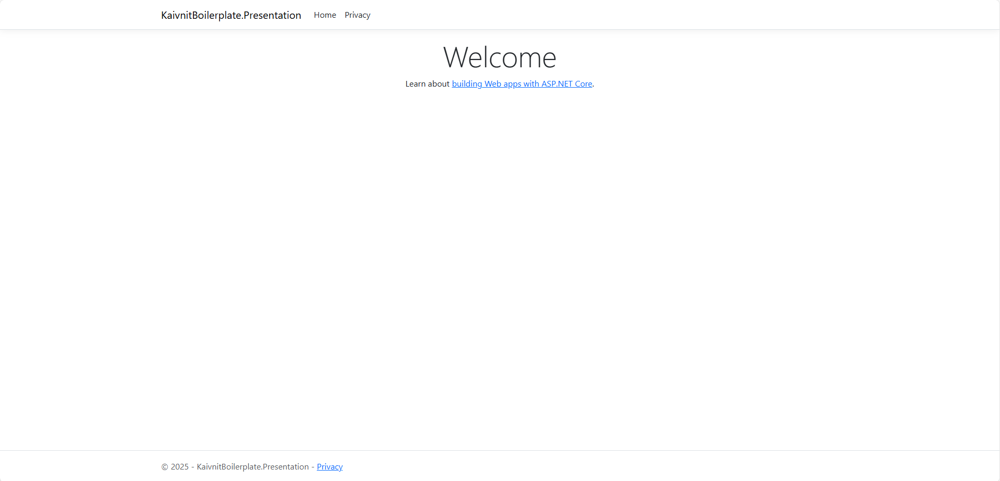

# KaivnitBoilerplate

## Overview
A boilerplate project built with Clean Architecture and Domain-Driven Design (DDD), using .NET 10.0 and ASP.NET Core Razor Pages.

## Project Structure

The project is organized into 4 main layers following Clean Architecture principles:



### 📁 Directory Structure
```
KaivnitBoilerplate/
├── src/
│   ├── KaivnitBoilerplate.Domain/          # Domain Layer (Core Business Logic)
│   ├── KaivnitBoilerplate.Application/     # Application Layer (Use Cases)
│   ├── KaivnitBoilerplate.Infrastructure/  # Infrastructure Layer (Data Access, External Services)
│   └── KaivnitBoilerplate.Presentation/    # Presentation Layer (Web UI - Razor Pages)
├── images/
│   └── screenshot-base-project.png         # Project structure screenshot
├── KaivnitBoilerplate.slnx                 # Solution file
└── README.md
```

### 🏗️ Clean Architecture

#### 1. **Domain Layer** (`KaivnitBoilerplate.Domain`)
- **Purpose**: Contains entities, value objects, domain services and core business rules
- **Characteristics**: 
  - No dependencies on any other layers
  - Contains pure business logic
  - Framework: .NET 10.0 (Class Library)

#### 2. **Application Layer** (`KaivnitBoilerplate.Application`)
- **Purpose**: Contains use cases, application services and interfaces
- **Characteristics**:
  - Depends on Domain Layer
  - Defines interfaces for Infrastructure Layer
  - Framework: .NET 10.0 (Class Library)
  - References: Domain Layer

#### 3. **Infrastructure Layer** (`KaivnitBoilerplate.Infrastructure`)
- **Purpose**: Implements interfaces from Application Layer
- **Characteristics**:
  - Contains data access, external API calls, file system operations
  - Depends on Application and Domain Layer
  - Framework: .NET 10.0 (Class Library)
  - References: Application Layer, Domain Layer

#### 4. **Presentation Layer** (`KaivnitBoilerplate.Presentation`)
- **Purpose**: User interface and API endpoints
- **Characteristics**:
  - Uses ASP.NET Core Razor Pages
  - Depends on Application and Infrastructure Layer
  - Framework: .NET 10.0 (Web Application)
  - References: Application Layer, Infrastructure Layer


## 🛠️ How to Run the Project

1. **Clone repository**
   ```bash
   git clone https://github.com/kaivnit/KaivnitBoilerplate.git
   cd KaivnitBoilerplate
   ```

2. **Restore packages**
   ```bash
   dotnet restore
   ```

3. **Build solution**
   ```bash
   dotnet build
   ```

4. **Run application**
   ```bash
   cd src/KaivnitBoilerplate.Presentation
   dotnet run
   ```

5. **Access application**
   - Open browser and navigate to: `https://localhost:5001` or `http://localhost:5000`
